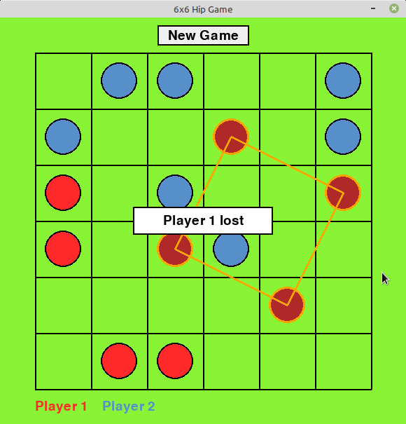
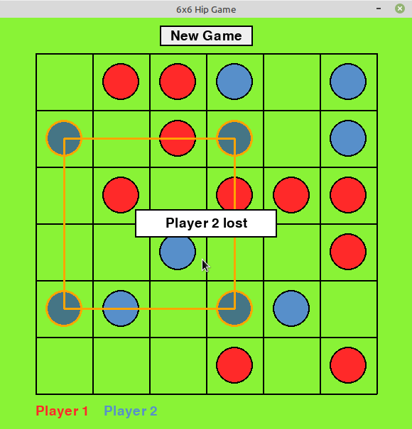
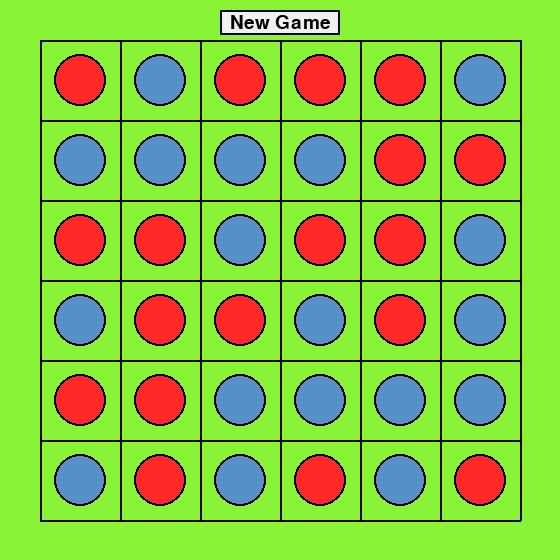
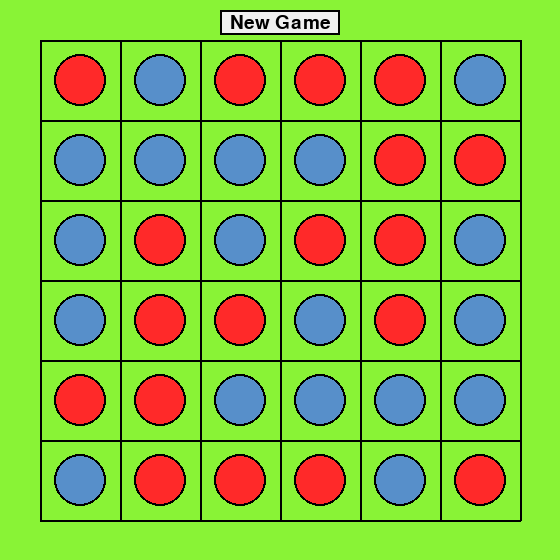

### A Deep Q-Network bot for the game of Hip
This is a ML/reinforcement learning project. The goal was to explore how the DQN approach can be used to build an AI bot for playing the game known as *Hip*.

The game of Hip, introduced by Martin Gardner back in the 1950s, is a board game for two players. The board is a rectangular grid, originally proposed to be of dimension 6-by-6, but it can be generalized to any n-by-m grid with $n, m > 1$. The players take turns marking a single cell either red, for player 1, or blue, for player 2. A player loses if a square with vertices of their respective color appears on the board.

  
  

On a $n$-by-$n$ board for $n\leq 6$ a game can end in a draw, though on the 6-by-6 board draws are pretty rare. In fact, originally, a puzzle proposed by M.Gardner was to find at least one drawing position on such a board. A complete answer to that puzzle (can be found by a simple backtracking algorithm) is that there are 24 6-by-6 draws in total, which can be obtained by rotations and reflections of the following 3 configurations:

  
  
  

No draws are possible on a $n$-by-$n$ board for $n>6$.

On a $2n$-by-$2n$ board, the second player has a strategy that guarantees at least a draw if $n\leq 3$ and a win for larger $n$. This can be attained by playing moves symmetrically, with respect to the central vertical or horizontal axis of the board, to the first-player moves. The strategy, naturally, does not apply to the odd-by-odd board. In such case, "passing a move" by covering the central cell at the first step and then playing central-symmetrically does not help the first player in general.

#### The project
We train a Deep Q-Network with a single agent playing against itself on a board of a given dimension.Effectively, it is a cooperative mode since the reward function for the single agent returns the same penalty value, whenever either one of the two players (governed by the same agent) loses. Trained over 50000 episodes on a 6-by-6 board, the bot achieves the mean game length of about 27 moves.

#### Structure
See `game/` for the game logic module. Simple graphics is rendered by pygame (`game_graphics/`). The DQN agent operates on a two-layer NN model run in pytorch (`ai/`). 

See `main.py` to run single game or a match between humans/bots, and `train_agent.py` to run a training session for a DQN agent. The reward function is fully customizable. So there is room for experiments or adapting it to other pattern-avoidance or pattern-creation board games of a similar kind. The game and the NN parameters are in `config.py`.

The bot training and bot playing components require PyTorch. Otherwise, the board rendering and the game logic modules can be used as stand-alones.

#### Further development
Train a Monte Carlo search tree model for an antagonistic play. Otherwise, DFS with pruning would probably work fine on boards that are not too large.

#### References

[1] Martin Gardner, *New Mathematical Diversions: Revised Edition*, MAA Press, 2000

[2]  *The Deep Q-Learning Algorithm*, https://huggingface.co/learn/deep-rl-course/en/unit3/deep-q-algorithm

[3] Linus Strömberg, Viktor Lind
*Board Game AI Using Reinforcement Learning*, https://www.diva-portal.org/smash/get/diva2:1680520/FULLTEXT01.pdf

